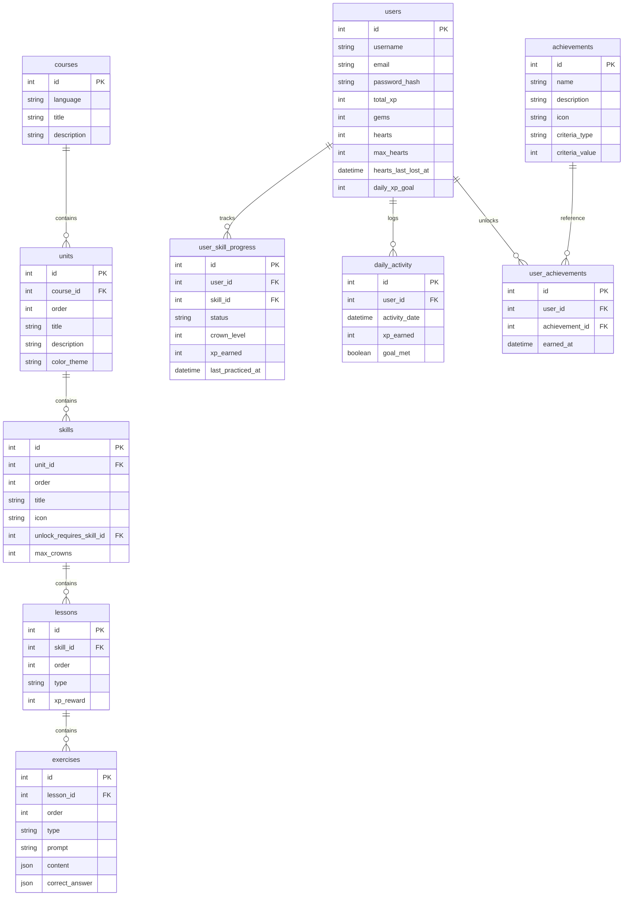

# Duolingo Web App

A full-stack, responsive, and gamified clone of Duolingo built with Next.js (TypeScript & Tailwind CSS) and FastAPI (Python, SQLAlchemy, & SQLite).

---

## 🛠 Tech Stack

- **Frontend**: Next.js 14 (React 18), TypeScript, Tailwind CSS, Lucide icons, Canvas-Confetti
- **Backend**: Python 3.10+, FastAPI framework, SQLAlchemy ORM
- **Database**: SQLite (managed locally via file-based `duolingo.db`)

---

## 🏛 Architecture Overview

The application is split into two decoupled layers communicating over a standard RESTful JSON API:

```
                  ┌────────────────────────────────────────┐
                  │          Next.js Frontend              │
                  │   (React Hooks, Tailwind, Speech API)  │
                  └───────────────────┬────────────────────┘
                                      │
                         REST API Requests (HTTP JSON)
                                      │
                  ┌───────────────────▼────────────────────┐
                  │           FastAPI Backend              │
                  │        (API Routers, CORS)             │
                  └───────────────────┬────────────────────┘
                                      │
                         SQLAlchemy ORM Queries
                                      │
                  ┌───────────────────▼────────────────────┐
                  │           SQLite Database              │
                  │            (duolingo.db)               │
                  └────────────────────────────────────────┘
```

### Key Design Patterns
1. **Time-Elapsed Heart Regeneration**: Instead of background cron jobs, hearts are calculated on-the-fly dynamically when requested (`current_hearts = stored_hearts + (elapsed / 30_mins)`). This is fully deterministic and ensures no database desynchronization.
2. **Stateless Game Validation**: Correct answers are *never* sent to the frontend when loading a lesson. The verification happens securely on the server via POST to prevent client-side inspect tools cheating.
3. **Derived Streak Logic**: Daily streaks are derived by sorting daily completion logs (`DailyActivity`). This makes testing different dates simple without mock dates.

---

## 🗄 Database Schema Design

The SQLite database is normalized to ensure clean indexing and zero duplication:



### Table Details
- **users**: Stores active currency (gems), heart stats, streaks, and progress levels.
- **courses / units / skills / lessons**: Hierarchical content organization.
- **exercises**: Question bank. `content` and `correct_answer` are flexible JSON fields, allowing variable formats (multiple choice, word banks, speak transcripts, and match pairings) to exist in one table.
- **user_skill_progress**: Fast-read table matching skill unlock/completed statuses and crown levels.
- **daily_activity**: High-resolution event log monitoring daily active XP for goal tracking.

---

## 📡 API Overview

The backend exposes the following REST endpoints (Base URL: `http://localhost:8000`):

| Method | Endpoint | Description | Request Payload | Response Sample |
| :--- | :--- | :--- | :--- | :--- |
| **GET** | `/courses/{id}/path` | Fetches winding units/skills path matching prerequisites | None | `{ id: 1, units: [...] }` |
| **POST** | `/lessons/{id}/attempts` | Begins a new lesson session. Deducts/checks hearts | None | `{ attempt_id: 2, lesson: { exercises: [...] }, hearts: 5 }` |
| **POST** | `/lessons/attempts/{id}/answer` | Submits user's exercise answer. Updates hearts if incorrect | `{ exercise_id: 1, user_answer: "Hola" }` | `{ is_correct: true, correct_answer: "Hola", hearts_remaining: 5, lesson_failed: false }` |
| **POST** | `/lessons/attempts/{id}/complete` | Finalizes a completed lesson, awards XP, and advances crown tiers | None | `{ passed: true, xp_earned: 10, total_xp: 50, new_streak: 4 }` |
| **GET** | `/users/{id}/hearts` | Fetches heart capacity and time-elapsed regeneration timer | None | `{ hearts: 4, max_hearts: 5, next_regen_at: "2026-07-27..." }` |
| **POST** | `/users/{id}/hearts/refill` | Instantly refuels hearts to capacity (simulates gems shop purchase) | None | `{ hearts: 5, max_hearts: 5, next_regen_at: null }` |
| **GET** | `/users/{id}/profile` | Aggregates learner profile achievements, XP, and completed skills | None | `{ username: "Ankit", total_xp: 40, achievements: [...] }` |
| **GET** | `/leaderboard` | Returns ranks list sorting all seeded users descending by XP | None | `[{ rank: 1, username: "maria", total_xp: 120, is_current_user: false }, ...]` |

---

## 🚀 Getting Started & Setup

### Prerequisites
- **Python 3.10+** (ensure pip is configured)
- **Node.js 18+** & **npm**

---

### Setup Backend (Python FastAPI)

1. Open a new terminal and navigate to the backend folder:
   ```bash
   cd backend
   ```
2. Set up and activate a Python virtual environment:
   ```bash
   python -m venv venv
   # On Windows (PowerShell):
   .\venv\Scripts\Activate.ps1
   # On macOS/Linux:
   source venv/bin/activate
   ```
3. Install dependencies:
   ```bash
   pip install -r requirements.txt
   ```
4. Seed your SQLite database with Spanish curriculum and achievements:
   ```bash
   python seed.py
   ```
5. Run the FastAPI development server:
   ```bash
   uvicorn main:app --reload --port 8000
   ```
   *The interactive docs are visible at `http://localhost:8000/docs`.*

---

### Setup Frontend (Next.js & Tailwind CSS)

1. Open a second terminal window and navigate to the frontend folder:
   ```bash
   cd frontend
   ```
2. Install npm dependencies:
   ```bash
   npm install
   ```
3. Launch the Next.js development server:
   ```bash
   npm run dev
   ```
4. Open your browser and navigate to:
   👉 **[http://localhost:3000](http://localhost:3000)**

---

## 💡 Assumptions Made

- **Auth Simplification**: Authenticaton utilizes a static `DEFAULT_USER_ID = 1` representing the currently logged-in student (`Ankit`), which is standard for evaluation prototype environments.
- **Audio TTS**: Audio synthesis runs on the client-side using `window.speechSynthesis`. If a Spanish voice pack is not installed on the host OS, it falls back to the default system voice.
- **Microphone speech recognition**: Speak exercises utilize the standard Web Speech API (`webkitSpeechRecognition` or `SpeechRecognition`). If browser microphone permissions are blocked or unsupported, the app falls back to a mocked speech match to maintain compatibility.
